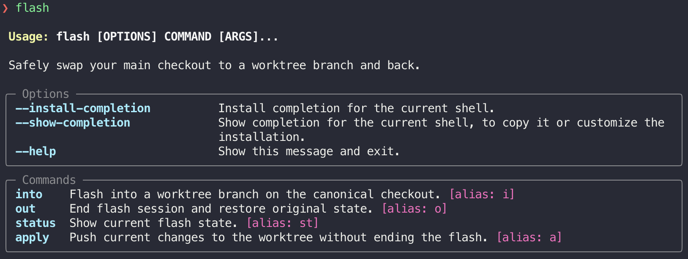
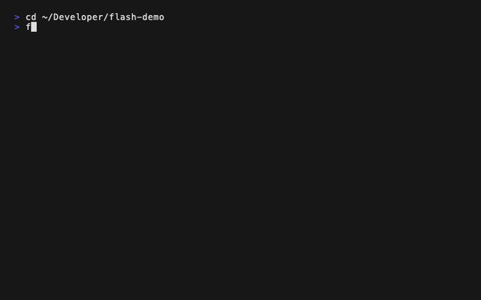

<h1 align="center">⚡ flash</h1>

<p align="center">
  Preview worktree branches from your main checkout while safely stashing your working state.
</p>

<p align="center">
  
</p>

## Why

Worktrees are great for parallelizing work, but your dev environment — backend servers, locally running frontend, etc — lives in your main checkout. When you need to test changes on a worktree, you're stuck doing a manual stash-checkout-test-restore dance, carefully tracking not to throw away diffs on either branch.

`flash` does the whole dance in one command and tracks every step so nothing gets lost.

Inspired by [Conductor's Spotlight](https://docs.conductor.build/guides/spotlight-testing).

## Install

```bash
uv tool install worktree-flash        # or pipx install worktree-flash
```

Or from source:

```bash
git clone https://github.com/WillTwait/flash.git
uv tool install ./flash
```

Requires Python 3.10+.

## Commands

| Command               | Alias      | Description                                        |
| --------------------- | ---------- | -------------------------------------------------- |
| `flash into [name]`   | `flash i`  | Switch to a worktree's branch (or open fzf picker) |
| `flash out`           | `flash o`  | End flash, restore original branch + stash         |
| `flash out --apply`   |            | End flash, send changes to worktree first          |
| `flash out --discard` |            | End flash, throw away changes                      |
| `flash apply`         | `flash a`  | Send changes to worktree without ending flash      |
| `flash status`        | `flash st` | Show current flash state                           |

## Typical workflow



```bash
flash into my-worktree    # stash, checkout worktree branch
# run server, test, poke around, fix things, commit
flash apply                # cherry-pick commits + sync files back to worktree
# keep testing
flash out                  # restore original branch, pop stash, clean up
```

## Details

`flash into` — switch your checkout to a worktree's branch

1. Stash uncommitted changes (tracked by SHA)
2. Create and checkout a temp branch at the worktree's HEAD
3. Copy the worktree's uncommitted changes into your checkout
4. Write `.flash/state.json` to track everything

Pass a worktree name or branch, or omit for an fzf picker.

`flash apply` — send your changes back to the worktree

1. Back up the worktree's state via `git stash create`
2. Clean the worktree for a conflict-free cherry-pick
3. Cherry-pick new commits into the worktree's history
4. Copy uncommitted file changes to the worktree

Safe to run multiple times. If anything fails, the backup stash SHA is printed for recovery.

`flash out` — restore your original branch

1. Prompt `[a]pply / [d]iscard` if you have unsent changes
2. Checkout your original branch
3. Delete the temp branch
4. Pop your stash by SHA
5. Remove `.flash/` entirely

## Usage with Claude Code

Add this to your project's `CLAUDE.md` so Claude understands how to use flash:

```markdown
## Flash (worktree previewing)

`flash` is installed and available for previewing worktree branches from the main checkout.

- `flash into <name>` — switch to a worktree branch (stashes current work automatically)
- `flash out --discard` — restore original branch (use `--apply` to send changes back to worktree)
- `flash apply` — send commits + uncommitted changes to the worktree without ending the flash
- `flash status` — check current flash state

When you need to test or review code from a worktree, use `flash into` instead of manually
checking out branches. Always `flash out` when done.
```

## Safety

| Risk                           | Mitigation                                           |
| ------------------------------ | ---------------------------------------------------- |
| Losing stashed changes         | Tracked by SHA, not index position                   |
| Losing worktree state on apply | `git stash create` backup before any destructive op  |
| Double flash                   | Refused if already flashed in                        |
| Branch conflict with worktree  | Uses `flash/<branch>` temp branch                    |
| Interrupted mid-operation      | State file has everything needed for manual recovery |
| Non-interactive (CI/agents)    | Defaults to `--discard` with a warning               |
